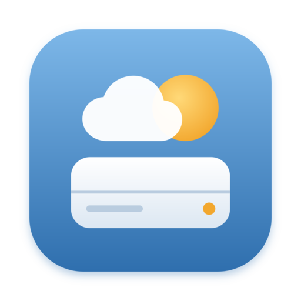

<p align="center">
  
</p>

<h1 align="center">Disk Forecast</h1>

<p align="center">See when your Mac's disk will fill up, what's filling it, and reclaim space safely. A free, source-available alternative to DiskBuddy, DaisyDisk, and CleanMyMac.</p>

<p align="center">
  <a href="https://diskforecast.com">diskforecast.com</a> ·
  <a href="https://github.com/coreyhaines31/diskforecast/releases/latest">Download</a> ·
  <a href="https://github.com/coreyhaines31/diskforecast/issues">Issues</a>
</p>

---

Disk Forecast lives in your menu bar. It shows how much space is free and, once it has a few days of history, when the disk will be full at the pace it's filling ("Full in ~41 days"). Click it to see what's taking the most space and how much is safe to clear.

## Features

- **Forecast** — free space in the menu bar, sampled hourly into a daily history, with a straight-line forecast over the last 30 days.
- **Top space consumers** — the folders that actually hold the space, described at a useful depth (`~/Library/Developer/Xcode`, not just `~/Library`).
- **Safe to clear, in one click** — caches, logs, Xcode DerivedData and device support, package manager caches (npm, pnpm, Bun, Cargo, Gradle, pip), and `node_modules` and build folders in projects you haven't touched in 30 days.
- **Worth a look** — big downloads, disk images and installers, virtual machines, Docker, Xcode archives, build folders in active projects, and local AI models from Ollama, LM Studio, and Hugging Face. Nothing here is checked until you choose.
- **System Data, explained** — local Time Machine snapshots, purgeable space, the Spotlight index, simulators, Apple Intelligence and Siri models, and Docker, each reclaimed with Apple's or the tool's own command (`tmutil`, `mdutil`, `xcrun simctl`, `docker system prune`). Every command is shown before it runs.
- **Everything goes to the Trash.** Nothing is ever deleted outright, and nothing outside your home folder is ever touched.
- **Fast and accurate** — a `getattrlistbulk` scanner on a thread pool measures millions of files a minute, and counts hard links and APFS clones once, so its numbers match what the disk actually spends.
- **Works without Full Disk Access** — grant it to see everything, or continue with your home folder only. Folders macOS guards are skipped instead of setting off a stream of permission prompts.
- **Zero telemetry.** Update checks are the only network traffic.

## Install

**Download** the latest DMG from [Releases](https://github.com/coreyhaines31/diskforecast/releases/latest) and drag Disk Forecast to Applications. The app is signed and notarized, and updates itself.

**Homebrew** (from the first release on):

```sh
brew install --cask coreyhaines31/tap/diskforecast
```

Requires macOS 14 Sonoma or later. Disk Forecast is distributed directly, not through the App Store: the App Store's sandbox can't measure the whole disk.

## Building from source

Requires Xcode 16+ and [XcodeGen](https://github.com/yonaskolb/XcodeGen).

```sh
brew install xcodegen swiftlint
xcodegen generate          # creates DiskForecast.xcodeproj from project.yml
open DiskForecast.xcodeproj
```

Or from the command line:

```sh
xcodebuild -project DiskForecast.xcodeproj -scheme DiskForecast test
swiftlint --strict
```

The scanner, forecast, cleanup catalog, Trash rules, and System Data parsers live in `Packages/DiskForecastCore` with unit tests, so they can be tested without launching the app. The app icon is rendered from `site/images/icon.svg` by `Scripts/render-app-icon.sh`, so the app and the site share one drawing.

## Releasing

`Scripts/release.sh 1.0.0` archives, signs with Developer ID, notarizes, builds the DMG, signs the Sparkle update, publishes a GitHub release with the DMG and `appcast.xml`, and bumps the Homebrew cask. Pushing a tag like `v1.0.0` runs the same script in the [release workflow](.github/workflows/release.yml) once the repo variable `CI_RELEASES` is `true` and the App Store Connect API key secrets exist.

One-time setup:

- **Sparkle key:** the EdDSA private key is in the login keychain under the account `diskforecast` (the release script passes `--account diskforecast`, so Midnight Oil's key is never used). The public key is `SUPublicEDKey` in `project.yml`. For CI, export it to the `SPARKLE_PRIVATE_KEY` secret.
- **Notarization:** `xcrun notarytool store-credentials diskforecast-notary`, or set `NOTARY_PROFILE` to an existing profile.
- **Homebrew:** a `Casks/diskforecast.rb` cask in `coreyhaines31/homebrew-tap`; the script updates its version and checksum.

Updates are served from `https://github.com/coreyhaines31/diskforecast/releases/latest/download/appcast.xml` (`SUFeedURL`).

## License

[FSL-1.1-MIT](LICENSE) © Corey Haines. Free to use and modify, including at work; you can't resell it or build a competing product from it. Each release becomes MIT two years after it ships.

The Disk Forecast name and icon are covered by the [trademark policy](TRADEMARK.md). Contributions are welcome under the [contributor terms](CONTRIBUTING.md).
